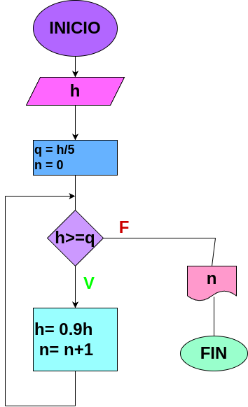

# Analisis

Una pelota se deja caer desde unaaltura h y en cada rebote sube el 10% menos.

## Input

### Variables de entrada 

h: Ingrese la altura ala cual somete la pelota

### Proccesing
q: h / 5

n = 0

Mientras h > q:

h * 0.9

n + 1

### Output

# Diagrama

# Construccion